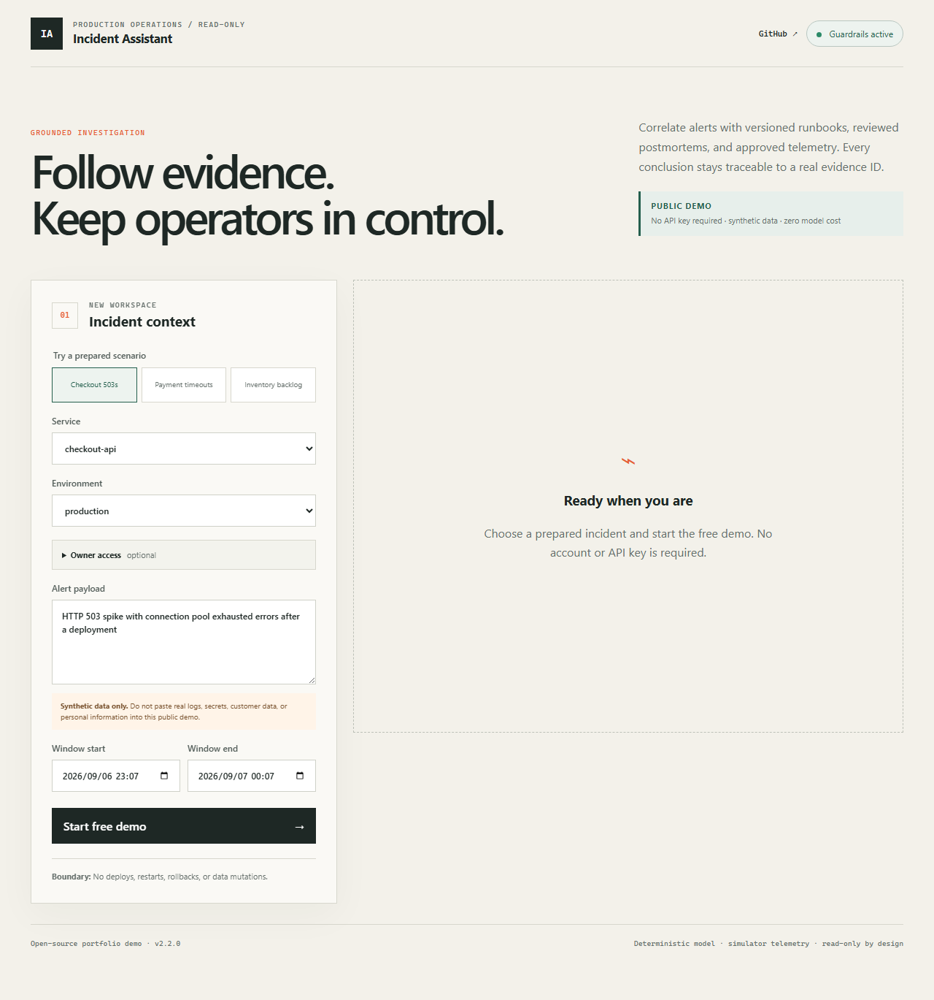

# Qihui Pan | Engineering Portfolio

## LLM Production Incident Assistant

**A full-stack incident investigation assistant with traceable evidence and human-controlled tools.**

Project type: independent portfolio project. Application release: v2.2.0. Portfolio prepared: September 11, 2026.

[Download the designed PDF](../output/pdf/QihuiPan_Incident_Assistant_Portfolio.pdf) · [Try the hosted demo](https://llm-incident-assistant.onrender.com/) · [Source code](https://github.com/QihuiPan/llm-production-incident-assistant) · [Release](https://github.com/QihuiPan/llm-production-incident-assistant/releases/tag/v2.2.0)

## The problem

An on-call engineer investigating an alert needs to connect error signatures with runbooks, previous incidents, deployment history, logs, and metrics. Those sources have different levels of trust and can be incomplete. A useful assistant must show the evidence behind its hypotheses and keep operational decisions with the engineer.

## The solution

The workspace accepts a service, environment, alert, and time window. It retrieves versioned documentation, composes a preliminary assessment with evidence identifiers, and proposes bounded read-only queries. An authenticated operator separately approves tool execution. Results retain source versions, trust labels, and audit metadata.

The hosted demo offers checkout errors, payment timeouts, and inventory backlog scenarios without a key. It uses deterministic generation and synthetic telemetry. The repository also implements configurable external-model and production-telemetry adapters, but these are not active in the public demo.

## Product walkthrough

1. Choose a prepared incident and adjust its context.
2. Read the preliminary hypothesis, timeline, and evidence register.
3. Inspect source filenames, versions, trust labels, excerpts, and evidence IDs.
4. Review proposed deployment, log, and metric queries. Public visitors see proposals; authenticated operators may approve execution.
5. In authenticated mode, inspect trace aggregates, record feedback, and export a Markdown postmortem draft.

For the verified checkout smoke test, the response contained seven evidence items, one preliminary hypothesis, and three pending queries. This is a demonstration of the workflow, not a validated diagnosis of a real incident.

## Architecture and implementation

| Layer | Implementation | Purpose |
| --- | --- | --- |
| Workspace | React, TypeScript, Vite | Responsive incident form and evidence review. |
| API | Python, FastAPI, Pydantic | Request validation, role checks, and orchestration. |
| Retrieval | PostgreSQL full-text search, pgvector, reciprocal rank fusion | Combine lexical and vector candidates with metadata filters. |
| Ranking | Query decomposition, trust-aware reranking, deduplication, context compression | Select a bounded set of relevant sources. |
| Generation | Deterministic provider; configurable Responses-compatible external provider | Structured hypotheses and timelines with citation validation. |
| Tool gateway | Typed schemas, allowlists, human approval, scope and row limits | Bound log, metric, deployment, and service-catalog reads. |
| Operations | PostgreSQL storage, traces, model cache and cost ledger; optional Redis Queue workers | Persistence and inspectable execution. |
| Delivery | Docker, GitHub Actions, Render; Kubernetes configuration | Reproducible builds and deployment paths. |

### Hosted and configurable capabilities

- **Hosted demo:** one Render free web service, PostgreSQL with pgvector, deterministic generation, simulator tools, and inline jobs.
- **Configurable deployment:** external Responses-compatible model, fixed production telemetry endpoints, Redis Queue workers, and Kubernetes resources. These require credentials and environment-specific validation.

The vector branch uses deterministic 768-dimensional feature hashing. It is not a trained semantic embedding model. The public demo and authenticated runtime currently share storage and retrieval; this is not a multi-tenant data-isolation system. Keep the hosted corpus synthetic.

## Engineering decisions

- **Traceability:** evidence IDs, source versions, trust labels, and quote hashes make retrieved context inspectable. Citation validation checks identifier membership; it does not independently prove that a claim is true.
- **Human control:** tools are read-only and require a separate approval. Schema, service, time-window, row, and call-count constraints are enforced by the server.
- **Cost-conscious demonstration:** the public profile uses deterministic generation and rejects an external model or production telemetry when public mode is enabled.
- **Deployment flexibility:** runtime factories support a lightweight local profile and a PostgreSQL-backed deployment. The free hosted profile uses inline jobs; a separate worker and queue are available in the full stack.

## Verification evidence

Validation below refers to the v2.2.0 release verification on September 7, 2026, not an always-on availability guarantee.

| Check | Recorded result | Interpretation |
| --- | --- | --- |
| Local backend suite | 40 passed, 1 Docker-dependent test skipped | Unit, API, security, retrieval, and orchestration regression checks. |
| Local backend coverage | 82.21% | Coverage across API, retrieval, tools, and evaluation packages. |
| Synthetic benchmark | 100 cases; strict and A/B gates passed | 80 development and 20 held-out synthetic cases. |
| Browser tests | 4 desktop/mobile checks passed | Keyless investigation and horizontal-overflow checks. |
| GitHub CI | Backend, web, E2E, and containers passed | Automated release checks for commit `fbc6896`. |
| Release images | Three image builds published successfully | API, web, and combined Render runtime. |

The benchmark runs an in-memory index and deterministic generation. Its proxy checks cover root-cause term matching, at least one expected source hit, evidence-ID membership, and expected-tool coverage. They do not establish semantic entailment, full evidence recall, or the absence of unnecessary queries. The dataset overlaps the demo corpus vocabulary and the composer recognizes a small set of patterns. Passing these gates demonstrates regression behavior, not real-world production accuracy or reduced incident resolution time.

## Limitations and next validation

The public demo is a portfolio deployment. Free hosting can sleep, and its free PostgreSQL instance has an expiry. Application-level rate limits are in-process and reset with the process; they are not distributed traffic protection. A real team deployment would need tenant-aware data authorization, suitable retention and backups, organization-specific telemetry validation, and evaluation on historical incidents with a trained embedding model and configured external model.

## Project summary

Built a full-stack incident investigation assistant with Python, FastAPI, React, and PostgreSQL/pgvector. The system combines keyword and vector retrieval to produce preliminary hypotheses linked to versioned evidence, with human approval for bounded read-only telemetry queries. It includes API-key roles, audit traces, structured model adapters, and reproducible Docker/CI delivery. A keyless public demo demonstrates three synthetic incident scenarios; a 100-case synthetic benchmark and automated API/browser checks support regression verification.

## Source references

- [Architecture](architecture.md), [API contracts](api.md), [deployment guide](deployment.md), and [evaluation limitations](error-analysis.md).
- [v2.2.0 CI run](https://github.com/QihuiPan/llm-production-incident-assistant/actions/runs/34044524392).
- [v2.2.0 release image run](https://github.com/QihuiPan/llm-production-incident-assistant/actions/runs/34044698810).
- [Changelog](../CHANGELOG.md).

## Rebuild the PDF

Install `reportlab` and `Pillow` in an authoring environment, then run `python scripts/build_portfolio.py` from the repository root. The builder creates `output/pdf/QihuiPan_Incident_Assistant_Portfolio.pdf` from curated English copy and the committed workspace screenshot. Update the copy in both this document and the builder when revising the portfolio.
